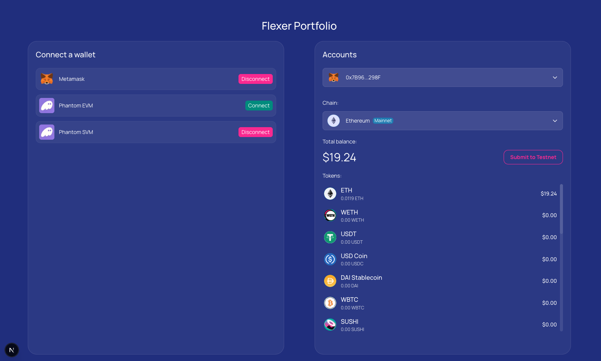

# Multi-Chain Wallet Balance & Inscription App

Implemented by Lizaveta Miasayedava (lizaveta.miasayedava@gmail.com).

Deployed to [https://flexer-portfolio.vercel.app/].



## TL;DR

The flow: connect wallets → select account → select chain → view balances.  
Click **"Submit to Testnet"** to send a transaction with an embedded message.

This repository includes implementations of the following features:

> _Note:_ The application is responsive for both large and small screens, but **is not supported on mobile devices**.

> _Note:_ Limitation: Wallet connections are currently tested on Google Chrome browser only.

---

### 1. 🔐 Wallet Connection (Ethereum & Solana)

Supports Ethereum wallets (MetaMask, Phantom Ethereum) and Solana wallets (Phantom Solana).

> _Note:_ Make sure the MetaMask and Phantom browser extensions are installed. Otherwise, wallet options will be disabled and labeled as "Not installed."

- Ethereum (EVM) wallet connection is handled via **Wagmi v2 / Viem**, chosen for its support of single-wallet connections and clean overrides. Each wallet’s state is managed via the `useEthereumWallet()` hook.
- Solana (SVM) wallet connection is implemented using `window.phantom.solana` with `@solana/web3.js`, managed via `useSolanaWallet()`.

Once connected, available accounts are listed in a dropdown on the right.  
**Balances are shown for the selected account and chain only** and are not mixed between EVM and SVM.

---

### 2. Token & Chain Fetching via LiFi API

- Implemented in `useLifiTokens()` and `useLifiChains()`, wrapped in SWR-style fetchers with caching and retry logic.
- No polling is used — data is only refetched on refocus within a session.
- All returned tokens and chains are shown. There's no pagination on the API side, but infinite scroll is implemented client-side.

> _Note:_ Rate-limiting errors happen and are still printed to the console.

---

### 3. Cumulative Wallet Balances

- Native token and ERC20/SPL token balances are fetched for each chain supported by LiFi.
- USD prices are retrieved from the LiFi response. No polling is used.

The **total balance** shown is the sum of the native token and other token balances on the selected chain.  
Tokens not listed in the LiFi response are excluded, as are tokens with invalid prices or balances.

- ERC20 token balances on EVM chains are fetched using a **multicall contract**.
- SPL token balances on Solana are fetched using the **SPL token program**.

---

### 4. Submitting Balances On-Chain

> _Note:_ Transactions are sent to **Sepolia (EVM)** and **Solana Devnet (SVM)**.  
> The payload contains the cumulative USD balance for the **selected chain** — not necessarily balances on Sepolia or Devnet.

- On EVM, the payload is sent to the **Ethscription smart contract** using `calldata`, since normal EVM wallets cannot receive arbitrary data.
- Transaction status updates are shown via toast notifications in the bottom-right corner.
- Once a transaction is sent, a link to the block explorer appears under the **"Submit to Testnet"** button.

State updates are managed by a **finite state machine (FSM)** singleton, using event listeners.

#### Prerequisites for Sending Transactions:

1. Switch MetaMask to the **Sepolia** network.  
   _(Programmatic switching is implemented, but wallet support may vary.)_
2. Enable **Testing Mode** in Phantom.
3. Fund your wallet with **Sepolia ETH** and **Solana Devnet SOL** from faucets to cover gas fees.

---

## Running the Application

This is a [Next.js](https://nextjs.org) project.

- **Runtime:** Node.js v20
- **Framework:** React.js v18
- **Language:** TypeScript (ES2018)
- **Styling:** Tailwind CSS

### 1. Install dependencies

```bash
npm install
```

> No `.env` variables are required.

### 2. Run the development server

```bash
npm run dev
# or
yarn dev
# or
pnpm dev
# or
bun dev
```

Then open [http://localhost:3000](http://localhost:3000) in your browser.

---

## Testing

Run unit tests with:

```bash
npm run test
```
